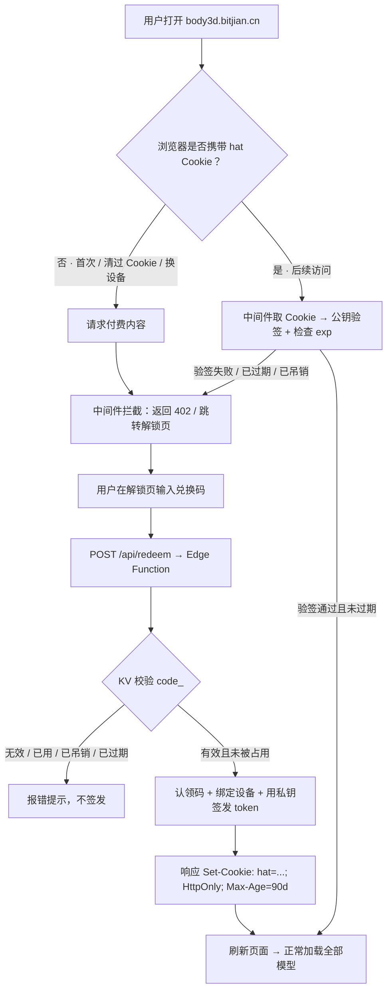
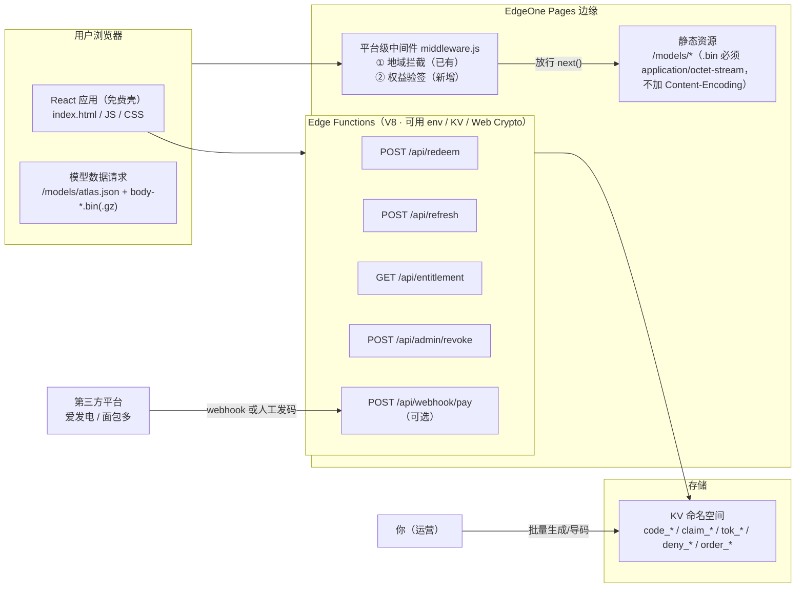
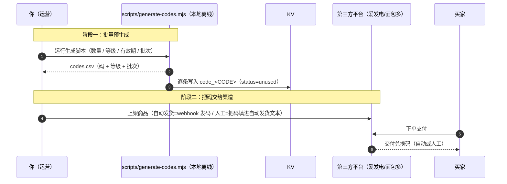
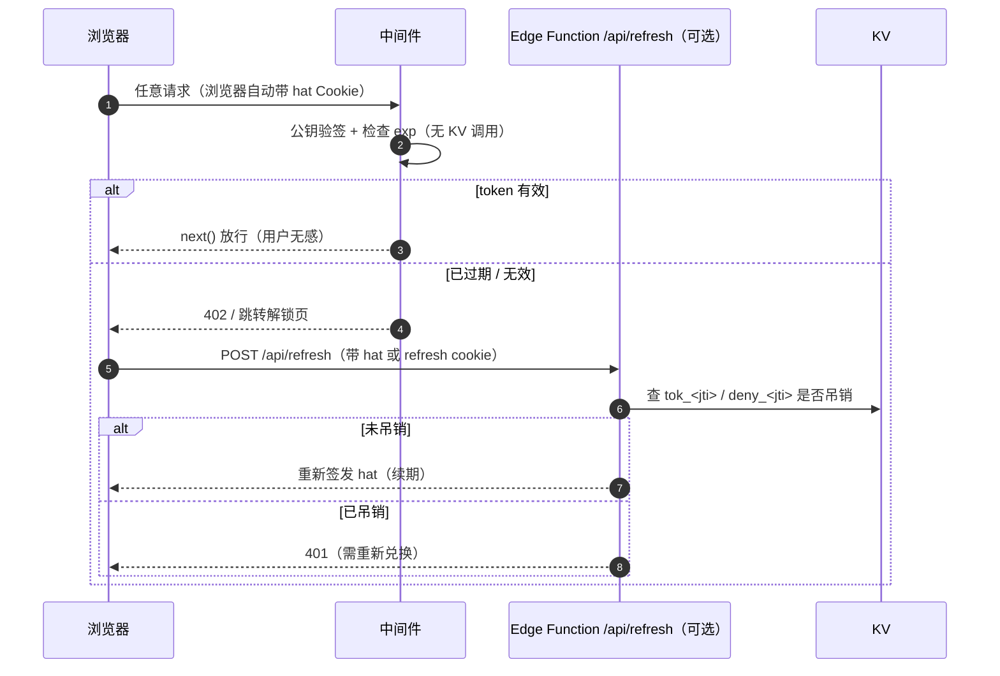
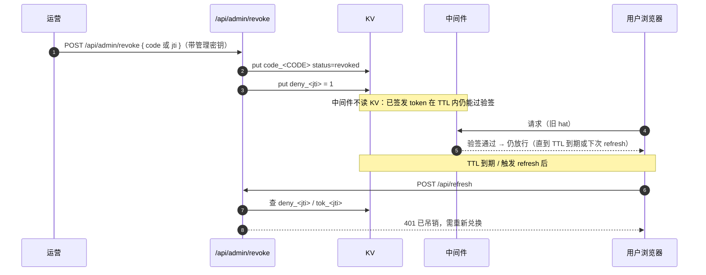
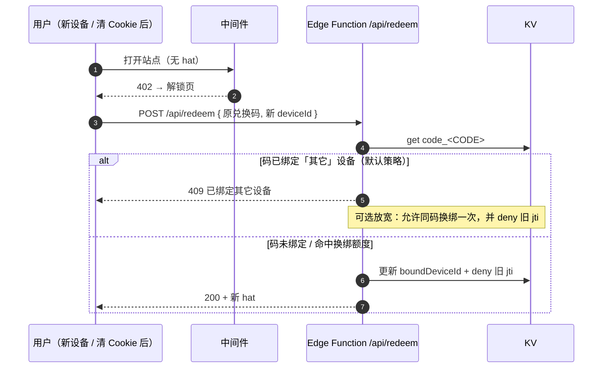
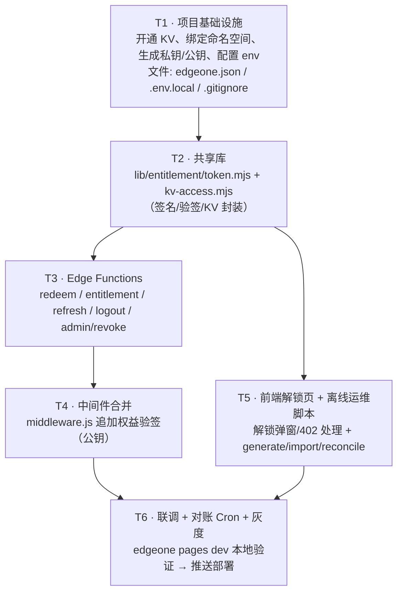

# 3D 人体解剖浏览器 · 「极轻方案 A：兑换码」权益解锁设计

> 对象：`human-atlas` fork（纯静态 3D 人体解剖浏览器 ｜ 2,234 结构 / 3,432 概念 / 15 系统）
> 技术栈：Vite + React 19 + TS + Tailwind 4 + three.js ｜ **无后端 / 无数据库 / 无用户系统（维持不变）**
> 部署：EdgeOne Pages 免费版 · `body3d.bitjian.cn`（已备案）· 全球可用区（含中国大陆）
> 已有中间件：仓库根 `middleware.js`（平台级，仅放行中国内地 + 港澳台）
> 文档性质：**架构设计（只出设计，不含业务实现代码）**；平台能力以官方文档为准，不确定处一律标注「**需进一步核实**」
> 编制：高见远（架构师）｜ 2026-09-12

---

## 〇、结论先行（TL;DR）

| # | 结论 | 一句话说明 |
|---|---|---|
| 1 | **兑换码不需要每次访问都输入** | 首次输入一次 → 服务端签发**长期签名 Cookie** → 之后浏览器每次自动携带，边缘**验签放行**，用户完全无感 |
| 2 | 只有 3 种情况才需要**重新输入** | ① 清了 Cookie / 换浏览器 ② 换设备 ③ 权益到期或被吊销 |
| 3 | 鉴权是**两层**，不是每次查 KV | 边缘中间件用**公钥验签（无状态、零 KV 调用）**做高频放行；Edge Function 用 **KV + 私钥**做低频签发/刷新 |
| 4 | 中间件**读不到 KV / 环境变量**（官方文档已核实） | 因此**私钥绝不放中间件**；中间件只放**公钥**（可公开），私钥走 Edge Function 的 `env` |
| 5 | KV **最终一致（边缘缓存最长 60s）**、**无原子 CAS** | 「同一码被两人同时兑换」不能靠单次原子操作兜底 → 用**一次性码 + 设备绑定 + Cron 对账**缓解 |
| 6 | **不夸大安全性** | 这本质是「提高分享成本」，**不是 DRM**：解了锁的人仍可下载全部 `.bin`；能防住的与防不住的，见第八节 |

---

## 一、正面回答核心疑问：兑换码要每次输入吗？

### 1.1 一段话讲透

**不需要每次输入。** 兑换码的角色只是「**第一次把权益兑换成凭证**」的一次性动作。用户首次输入正确后，服务端（Edge Function）校验 KV 里的码，然后用**只有服务端持有的私钥**签发一个**长期有效的签名令牌**，通过 `Set-Cookie` 写进浏览器（`HttpOnly` + `Max-Age=90天`）。此后用户每次访问，**浏览器会自动携带这个 Cookie**，边缘中间件只需用**公钥验一下签名 + 看有没有过期**就放行——**既不查 KV、也不要用户再输任何东西**。兑换码本身在成功兑换后就被标记为「已用」，再也不用重复输入。

> 换算成产品语言：**兑换码 = 一次性门票；签名 Cookie = 长期通行证。** 用户一辈子只买一次票，之后刷脸（Cookie）进场。

### 1.2 两条路径的区别（流程图）



### 1.3 首次兑换 vs 后续访问 对照

| 维度 | 首次兑换 | 后续访问（同一浏览器） |
|---|---|---|
| 用户动作 | 手动输入兑换码一次 | **无感，什么都不用做** |
| 后端动作 | Edge Function 查 KV + 私钥签发 | 中间件公钥验签（**不查 KV**） |
| 是否联网查 KV | 是（1 读 1 写） | **否** |
| 耗时 | 一次 Function 往返（几十 ms） | 边缘内存验签（亚毫秒级） |
| 失败后的表现 | 提示码无效/占用 | 重新走「首次兑换」流程 |

### 1.4 什么情况下需要重新输入

1. **清了浏览器 Cookie / 换了浏览器**（凭证丢失）。
2. **换了设备**（凭证在旧设备上）。
3. **权益到期**（token 过期）或 **码被吊销**。
4. 用户主动「退出登录」（清 Cookie）。

> ⚠️ 这里隐含一个产品决策：**没有账号体系时，「兑换码」本身就是唯一的找回凭证。** 必须引导用户**自己保存好兑换码**（见第八节）。可选缓解：清 Cookie 后允许**同一个码重新兑换**（见 4.4「换绑策略」）。

---

## 二、架构总览

### 2.1 组件图



### 2.2 分层职责（务必对齐官方已核实能力）

| 层 | 运行环境 | 能力 | 本方案职责 |
|---|---|---|---|
| **静态资源层** | EdgeOne CDN | 直接返回 `/models/*` | 保持 `.bin` 的 `Content-Type: application/octet-stream`、**绝不加 `Content-Encoding: gzip`** |
| **中间件层** `middleware.js` | 边缘 V8（每个匹配请求执行） | 只能拿 `request / next / redirect / rewrite / geo / clientIp`，**可读 Cookie、可直接返回响应、可改转发给源站的请求头**；**无 `env`、无 KV** | ① 地域拦截（现状）② **无状态**权益验签（用**公钥**） |
| **Edge Functions 层** | 边缘 V8（`edge-functions/`） | **有 `env`、可绑定 KV、可用 Web Crypto / fetch** | 兑换、刷新、校验、吊销、webhook；**持有私钥 + KV** |
| **KV 层** | EdgeOne KV | put/get/delete/list；**最终一致（边缘缓存 ≤60s）**；**仅 Edge Functions 可用** | 存 `码→权益`、token 记录、认领标记 |

> **一句话架构：中间件做「高频无状态验签」，Edge Function 做「低频有状态签发」。** 私钥只在 Function，公钥在中间件。

### 2.3 与现有地域中间件的关系（合并，不分层）

EdgeOne Pages **只加载一个平台级 `middleware.js`**（根目录，同时 `matcher: ['/:path*']`）。因此**不能新增第二个中间件文件**，只能**合并**：在现有 geo 判断之后，追加权益判断。建议结构：

```js
// middleware.js（设计示意，非最终实现；本次任务不修改该文件）
export function middleware(context) {
  const { request, next, geo, clientIp } = context;

  // ① 地域拦截（保持现状，最先失败最快）
  if (isBlockedRegion(geo)) return blockedRegionResponse(clientIp);

  // ② 权益验签（新增，无状态、零 KV）
  const gate = entitlementGate(request);          // 只读 Cookie + 公钥验签
  if (gate.isProtected && !gate.ok) return gate.deny(request); // 402 / 跳转解锁页

  // ③ 放行：.bin 路径不得改动任何响应相关头
  return next();
}
```

**顺序理由**：地域拦截更便宜且需要保留既有行为，放最前；权益验签只对受保护路径生效（见第六节）。两者互不冲突。

---

## 三、凭证机制设计

### 3.1 为什么不用「单纯 localStorage」

| 方案 | 能否自动附加到 `/models/*.bin` 请求 | 能否防 XSS 窃取 | 能否被「复制分享」 | 结论 |
|---|---|---|---|---|
| **localStorage 里的 token** | ❌ 静态资源是 `fetch`/`` 直接 GET，**默认不带自定义头**；要靠应用层给每个 URL 拼 token，改动大且易漏 | ❌ JS 可读，XSS 一偷即走 | ⚠️ 明文可随便复制粘贴 | 只能用于「应用内」鉴权，**挡不住直接 GET 静态分块** |
| **HttpOnly Cookie** | ✅ 浏览器**自动携带**，中间件天然可读 | ✅ JS **读不到** | ✅ 用户在浏览器里**无法直接复制**（需专业工具导出） | **本方案采用** |

> 关键：付费数据是 **15 个静态 `.bin` 的普通 GET 请求**，只有 **Cookie** 能让边缘中间件「零改动地」拦住它们。localStorage 做不到。

### 3.2 令牌形态：非对称签名 token（JWT 风格）

```
<base64url(header)>.<base64url(payload)>.<base64url(signature)>
```

```jsonc
// header
{ "alg": "EdDSA", "kid": "2026-09", "typ": "HAT" }
// payload
{ "sub": "<jti 唯一id>", "lvl": "pro", "exp": 1732419200, "dev": "<deviceHash 前16位>" }
// signature = sign(header.payload, 私钥)
```

- **中间件只用「公钥」验签**（公钥本就可公开，放中间件源码无泄密风险）。
- **私钥只在 Edge Function 的 `env` 中**（绝不进仓库）。
- 附带 `kid`（key id）以支持**密钥平滑轮换**（见 8.6）。

#### 能力核实（区分两侧，勿混为一谈）

| 侧 | Web Crypto / 非对称验签 | fetch | 结论 |
|---|---|---|---|
| **Edge Functions** | ✅ **官方已确认**（Web Crypto API / fetch / TextEncoder / Cookies / Cache 均支持） | ✅ | 签发 / 验签**确定可行** |
| **中间件 `middleware.js`** | ⚠️ **官方未确认**——中间件文档只列 `request / next / redirect / rewrite / geo / clientIp`，**未列任何 Runtime APIs** | ⚠️ 未确认 | **必须实测** |

> ⚠️ **中间件侧 `crypto.subtle` 必须实测定论**：写一个 **~20 行的 hello-world 中间件**（对 `crypto.subtle.digest` 或 `crypto.subtle.verify` 做一次调用，看是否可用、是否报错）即可定论。**在实测通过前，不要把「公钥验签」当成既定事实来排期。**

#### ⚠️ 降级为 HMAC 的严重风险（若中间件实测不支持 Web Crypto）

若中间件**无法**使用 `crypto.subtle`，只能退化为 **HMAC**：而中间件**读不到 `env`**，HMAC 密钥就只能**内联在 `middleware.js` 源码里**。

> 🔴 **如果这个 fork 的仓库是公开的，内联密钥 = 把签名密钥公开** → **任何人都能自己签一个 token 通行证，整套付费门控形同虚设**。这**不是「安全性略有下降」，而是直接失效**。

**三条缓解（按推荐度排序）：**

| # | 缓解 | 代价 / 前提 |
|---|---|---|
| ① | **优先走非对称验签**（若中间件实测支持 Web Crypto） | 无代价——**首选**，公钥可安全公开 |
| ② | **仓库转私有** | 零技术代价；但**丧失公开 fork 的开放性**，需产品侧决策 |
| ③ | **中间件 `fetch` 一个鉴权 Function**（把验签搬到 Function） | ⚠️ **每个资源请求多一次函数调用**：一次完整加载 = **~16 次**（1 目录 + 15 分块）调用，**须评估调用配额与延迟**（对比：中间件本地验签是 **0 次**调用） |

> 结论：**非对称验签（①）是唯一「既安全又零调用」的方案**；若不可用，请在 **②（转私有）** 与 **③（fetch 校验，牺牲调用数）** 之间**明确二选一**，**不要默认接受 HMAC 内联**。

#### 3.2.1 降级路径决策记录

| 项 | 内容 |
|---|---|
| **触发条件** | 中间件 `crypto.subtle` **实测不可用**（仅在此条件下才需要选降级路径） |
| **选定方案** | **③ 中间件 `fetch` 一个鉴权 Function** |
| **备选方案** | ② 仓库转私有 + HMAC（仅当「③ 也不可用，即中间件连 `fetch` 都不行」时才考虑） |
| **不做的事** | 不采用「HMAC 密钥内联 + 仓库保持公开」——那等于公开签名密钥，门控直接失效 |

**决策理由：**

1. **③ 保留了非对称密钥体系**：私钥始终只存在于 Edge Function 的 `env`，**密钥不落仓库**，且 token 带 `kid` 可**平滑轮换**；而 ② 会把**对称密钥固化进 `middleware.js`**，一旦泄露（私库协作者、误公开、备份/构建产物泄露）则**全体通行证作废，且无法只轮换密钥而不让所有用户重新兑换**。
2. **③ 的代价是可量化的、且相对总量可忽略**：一次完整加载的门控请求约 **16 个**（**1** 个 `atlas.json` + **15** 个数据分块），即相比本地验签多约 **16 次轻量函数调用**；而一次完整加载本身要传输 **~90MB**。与第九节结论一致 —— **真正的成本瓶颈在带宽/请求数，不在这 16 次调用**。
   - ⚠️ 注意口径：这 16 次是**门控路径的增量**，**不是全站请求增量**（CSS/JS/HTML 等非门控请求不受影响）。
3. **② 只在极端情况下才需要**：若实测发现「③ 也不可用」，说明中间件既不能验签也不能 `fetch`，此时才需要评估「仓库转私有 + HMAC」，并接受其密钥固化与轮换成本。

**前置行动（必须先做，不要凭猜测选路径）：**

> 写一个 **约 20 行的 hello-world 中间件**，在其中调用一次 `crypto.subtle.digest(...)`（或 `crypto.subtle.verify(...)`），用 `npx edgeone pages dev` 跑起来看是否可用、是否报错。**20 分钟内即可定论。** 实测通过 → 走 ①（首选，无需任何降级）；实测失败 → 再按上表走 ③。

### 3.3 Cookie 属性建议

| 属性 | 建议值 | 理由 |
|---|---|---|
| **name** | `hat` | 简洁，避免与平台 Cookie 冲突 |
| **HttpOnly** | `true` | **JS 不可读**，显著抬高 XSS/脚本窃取门槛 |
| **Secure** | `true` | 站点已 HTTPS，禁止明文信道传输 |
| **SameSite** | **`Lax`** | ⭐ 见下方说明 |
| **Max-Age** | `7776000`（90 天）｜ 或 **1 天 + refresh** | 90 天 = 少打扰用户；1 天 = 吊销更快生效（权衡见下） |
| **Path** | `/` | 必须覆盖 `/models/*`，故用根路径 |
| **Domain** | 省略（默认当前主机） | 只需作用于 `body3d.bitjian.cn` |

#### ⭐ SameSite 选值对静态站的影响

- **`Strict`**：**风险**——若用户从站外链接（如爱发电订单页、他人分享、搜索结果）**点进来**访问一个深层付费 URL，浏览器**首次顶层导航不带 Cookie**，用户会被误判为「未解锁」。对静态站（入口常来自外部）不友好。
- **`Lax`（推荐）**：**顶层 GET 导航会带 Cookie**（解决上面的入口问题），同时**跨站 POST / 内嵌请求不带**，保留了基本的 CSRF 防护。对同源 `fetch`（应用的 `/api/*`、`/models/*` 请求）**始终携带**。→ 静态站最佳平衡。
- **`None`**：**不用**。需要 `Secure` 且允许完全跨站携带，白白扩大攻击面。

> 结论：**`SameSite=Lax`**。这是静态 + Cookie 鉴权场景的标准选择。

### 3.4 密钥注入方式（回答「不要硬编码进仓库」）

```
┌───────────────────────────┐         ┌──────────────────────────────┐
│  私钥 PRIVATE_KEY          │         │  公钥 PUBLIC_KEY             │
│  · 放 Edge Function env    │ ──签发──▶│  · 上架进 middleware.js 源码 │
│  · 控制台 / edgeone.json   │         │  · 公钥可公开，进仓库无害     │
│  · 绝不进 Git              │         └──────────────────────────────┘
└───────────────────────────┘
```

- **私钥**：在 EdgeOne 控制台（或 `edgeone.json`）的**项目环境变量**里配置，例如 `ENTITLE_PRIVATE_KEY`（Ed25519 PKCS#8 / JWK，base64）。通过 `context.env.ENTITLE_PRIVATE_KEY` 读取。**本地开发**用 `.env.local`（**加入 `.gitignore`**）。→ 满足「不硬编码进仓库」。
- **公钥**：非敏感，**放进 `middleware.js` 常量**（中间件读不到 env，只能这样）。**这不算泄密**。
- **一份私钥可以只签发**（离线生成一次）。轮换见 8.6。

> ⚠️ **需进一步核实**：`middleware.js` 是否支持通过 `edgeone.json` 或构建期做常量替换（若支持，可让公钥也从外部注入而非写死）。

---

## 四、KV 数据结构

### 4.1 命名空间与绑定（来源：EdgeOne Pages 官方 KV 文档）

- 开通 KV 账户后创建命名空间，在**项目 → KV 存储**里**绑定**，绑定时的「**变量名**」即 Function 里的 `env.<变量名>`（如 `ATLAS_KV`）。
- 免费版：**存储容量 1GB**；**每账户最多 10 个命名空间**。
- **KV 目前仅支持在 Edge Functions 中使用**（中间件不可用）。
- **Key 限制**：长度 ≤ **512B**，**仅支持数字、字母及下划线**（⚠️ 因此 **key 里不能用 `:`、`-`，用 `_`**）。
- **Value 限制**：≤ **25MB**。
- **一致性**：**最终一致**，边缘缓存**最长 60s**；写入在**发起节点立即生效**，其他节点最长 60s 后收敛。

> **来源与置信度**：以上 KV 参数（1GB、10 命名空间、key 512B/字符集、value 25MB、最终一致 ≤60s）均来自 **EdgeOne Pages 官方 KV 文档** <https://test-pages.edgeone.ai/zh/document/kv-storage>（本文编制时读取）。**这些是官方文档明文，属已核实**；但**具体免费套餐的读写次数/调用次数配额**该文档**未列出** → 见第九节，标注「**需进一步核实**」。

### 4.2 Key 设计（遵守下划线字符集）

| Key 模式 | 含义 | 示例 |
|---|---|---|
| `code_<CODE>` | 码实体 | `code_AB12CD34EF` |
| `claim_<CODE>` | 认领标记（并发防护，首个写入者胜） | `claim_AB12CD34EF` |
| `tok_<jti>` | 已签发 token 记录（用于刷新时校验吊销） | `tok_5f3c2e...` |
| `deny_<jti>` | 吊销名单 | `deny_5f3c2e...` |
| `dev_<deviceId>` | 设备→最近 jti（可选，设备维度审计） | `dev_a1b2c3...` |
| `order_<orderRef>` | 第三方订单→码（webhook 幂等） | `order_afdian_9981` |
| `rl_<ip>` | 兑换接口限流计数（可选） | `rl_1.2.3.4` |

### 4.3 Value：JSON Schema

**① 码实体 `code_<CODE>`**

| 字段 | 类型 | 含义 |
|---|---|---|
| `code` | string | 码明文（便于对账） |
| `level` | string | 权益等级：`basic` / `pro` / `edu` |
| `status` | enum | `unused` / `redeemed` / `revoked` |
| `maxUses` | number | 最大可兑换次数（默认 **1**，一次性） |
| `createdAt` | number | 生成时间（epoch ms） |
| `redeemedAt` | number\|null | 首次兑换时间 |
| `exp` | number\|null | **权益到期时间**（epoch ms）；`null` = 永久 |
| `orderRef` | string\|null | 第三方订单号（可空，用于对账） |
| `boundDeviceId` | string\|null | 绑定的设备指纹（首个兑换设备） |
| `boundJti` | string\|null | 当前有效的 token jti |
| `note` | string | 批次备注（如 `batch-2026-09`） |

```jsonc
{
  "code": "AB12CD34EF",
  "level": "pro",
  "status": "redeemed",
  "maxUses": 1,
  "createdAt": 1757600000000,
  "redeemedAt": 1757686400000,
  "exp": null,
  "orderRef": "afdian_9981",
  "boundDeviceId": "a1b2c3d4e5f6",
  "boundJti": "5f3c2e...",
  "note": "batch-2026-09"
}
```

**② token 记录 `tok_<jti>`**（用于刷新/吊销校验）

```jsonc
{
  "jti": "5f3c2e...",
  "code": "AB12CD34EF",
  "deviceId": "a1b2c3d4e5f6",
  "level": "pro",
  "iat": 1757686400000,
  "exp": 1765452800000,
  "revoked": false
}
```

**③ 认领标记 `claim_<CODE>`**（并发防护）

```jsonc
{ "deviceId": "a1b2c3d4e5f6", "at": 1757686400000, "jti": "5f3c2e..." }
```

### 4.4 ⚠️ 原子性与并发：同一个码被两人同时兑换怎么办？

**问题的本质**：已核实 KV 是**最终一致**（边缘缓存 ≤60s），官方文档**未提供原子 compare-and-swap / 条件写**，且**写只在发起节点立即生效**。因此 `get → 判断 → put` 之间存在**竞态窗口**，无法用单次原子操作兜底。

**可行做法（分层缓解，按强度排序）：**

| 层级 | 做法 | 强度 | 说明 |
|---|---|---|---|
| **L1 设计规避** | **码 = 一次性**（`maxUses=1`）+ **首个兑换绑定 `boundDeviceId`** | 中 | 第二个**不同设备**的兑换一旦读到已用状态即被拒（409）。竞态只在 ≤60s 缓存窗口内、且两请求落在**不同节点**时成立 |
| **L2 认领标记** | 兑换时**先写 `claim_<CODE>`**（不覆盖已存在值），再读回确认「认领者==自己」 | 中 | 若两次写落到**同一节点**，先写者胜、后者会读到已存在标记而放弃 |
| **L3 Blob 强一致** | 把「认领」这一步改到 **Blob 存储的强一致模式**（官方文档明确提及其强一致能力） | 高 | ⚠️ **需进一步核实** Blob 强一致模式是否提供并发写/CAS 语义 |
| **L4 对账兜底** | **Cron 定时任务**扫描 `code_*`：同一码出现**两个不同 `boundDeviceId`** → 判为异常，**吊销后到者 token**（`deny_<jti>`） | 高（事后） | 个人项目量级（几千~几万）下竞态概率极低，事后纠正足够 |

**推荐组合**：**L1（一次性 + 设备绑定）+ L2（认领标记）+ L4（Cron 对账）**；若单码价值高（如 B2B 授权），叠加 **L3**。

> 诚实结论：在最终一致 + 无 CAS 的 KV 上，**做不到 100% 强一致的「一码一用」**；但可以用「一次性 + 绑定 + 对账」把风险压到与项目量级相称的水平。

---

## 五、接口定义

> 全部为 **Edge Functions**，目录**确定为 `edge-functions/`**（**不是** `cloud-functions/`、也不是 `functions/`）；路由由目录结构自动生成，**大小写敏感**。
> ⚠️ **静态资源路由优先于函数路由**——不要把函数路径命名成与静态文件同名（如别占用 `/models/*`）。
> **Handler 写法**：`EventContext = { request, params, env, waitUntil }`；导出 `export default function onRequest(context)`，或按方法分派 `onRequestGet / onRequestPost / onRequestPut / onRequestPatch / onRequestDelete / onRequestHead / onRequestOptions`。
> ⚠️ **Edge Functions 使用限制（≠ Cloud Functions）**：**代码包 ≤ 5MB**、**请求体 ≤ 1MB**、**CPU 时间片 200ms**（**不含 I/O 等待**）、语言 **JavaScript ES2023+**。本方案所有请求体都是**很小的 JSON**（远低于 1MB），不受影响；CPU 片是否够用见第九节。

| 方法 | 路径 | Handler | 用途 | 鉴权 | 请求体 | 成功响应 | 错误码 |
|---|---|---|---|---|---|---|---|
| POST | `/api/redeem` | `onRequestPost` | **兑换**：校验码 → 绑定 → 签发 Cookie | 无（码即凭证） | `{ code, deviceId }` | `200 { ok:true, level, exp, message }` + `Set-Cookie: hat=...` | `400 INVALID_CODE_FORMAT` / `404 CODE_NOT_FOUND` / `409 CODE_ALREADY_REDEEMED` / `410 CODE_REVOKED` / `410 CODE_EXPIRED` / `429 RATE_LIMITED` / `500` |
| GET | `/api/entitlement` | `onRequestGet` | **校验**当前 Cookie 是否有效 | 需 `hat` | — | `200 { ok:true, level, exp }` | `401 NOT_ENTITLED` |
| POST | `/api/refresh` | `onRequestPost` | **静默续期**（含吊销校验，可选启用） | 需 `hat`（或 refresh cookie） | — | `200 { ok:true }` + 新 `Set-Cookie` | `401 NOT_ENTITLED` / `403 REVOKED` |
| POST | `/api/logout` | `onRequestPost` | **退出**：清 Cookie | 需 `hat` | — | `200 { ok:true }` + `Set-Cookie: hat=; Max-Age=0` | — |
| POST | `/api/admin/revoke` | `onRequestPost` | **吊销**某个码/token | 需**管理密钥**（`env`） | `{ code? , jti? }` | `200 { ok:true }` | `401 UNAUTHORIZED` / `404 NOT_FOUND` |
| POST | `/api/webhook/pay` | `onRequestPost` | **支付回调**（第三方平台，可选） | 平台签名/密钥（**需核实**） | 平台自定义 | `200 { ok:true }`（幂等） | `400 BAD_SIGNATURE` / `409 DUPLICATE` |

**统一响应格式**：`{ "ok": boolean, "code": "STRING", "message": "...", "data": {...} }`（便于前端 i18n 双语映射）。

---

## 六、鉴权发生的位置 & 付费/免费划分

### 6.1 中间件「能做 / 不能做」（基于官方文档已核实）

| 能力 | 中间件 | 说明 |
|---|---|---|
| 读 `request`（URL / Header / **Cookie** / Query） | ✅ | 可拿到 `hat` Cookie |
| **直接返回响应**（JSON / HTML / 302） | ✅ | 未授权时返回 `402` 或跳转解锁页 |
| 改「转发给源站的**请求头**」 | ✅ | `next({ headers })` |
| 读 `geo` / `clientIp` | ✅ | 保留地域拦截 |
| **读 `env` 环境变量** | ❌（文档未列） | **故私钥不能放这里** |
| **访问 KV** | ❌（KV 仅限 Edge Functions） | **故每次鉴权不能查 KV** |

> **推论（本设计的支点）**：中间件只能做**无状态**判断 → 于是把「验签」做成**公钥验签**、把「查 KV」挪到低位频的 Edge Function。这样即使**每个 `.bin` 请求都过中间件**，也**零 KV 调用**。

### 6.2 付费内容 vs 免费内容 如何划分

产品是**单套整包数据**（`atlas.json` 1.3MB + 15 个 `.bin`），不像「题库 DLC」那样天然可切。给两个梯度：

| 梯度 | 免费 | 付费 | 改动量 |
|---|---|---|---|
| **MVP（推荐先上）** | 应用外壳（React/JS/CSS）+ 一个内置的**极简演示样本**（让 UI 可看可点） | **全部 `/models/*`**（目录 + 15 个分块） | 🟢 低 |
| **更友好（可选）** | 上面 + **1 个系统**的完整可浏览（`atlas.demo.json` + 1~2 个 demo 分块） | 完整目录 + 全部 15 分块 | 🟡 中（需额外产出 demo 数据） |

**拦截方式：拦截「路径」，而不是「数据分块」。** 理由：
- 分块本身不是自解释内容，单独拦某一分块没有产品意义；
- **目录（`atlas.json`）才是「钥匙」**——它定义了分块 URL 与结构，没有目录就拿不到可用的分块清单。

**两条候选拦截点：**

| 方案 | 做法 | 优点 | 缺点 |
|---|---|---|---|
| **A. 中间件拦 `/models/*`** | 中间件对 `/models/atlas.json`、`/models/body-*.bin(.gz)` 做公钥验签，未过 → `402`（JSON）/ 跳转解锁页（HTML） | 简单直接，路径稳定 | 需要中间件能验签（见 3.2 的 Web Crypto 核实） |
| **B. 目录走 Function + 分块用「不可猜文件名」** | `/models/atlas.json` 改由 Edge Function 门控下发（**但静态优先于函数，需改路径**，如 `/api/atlas`）；分块文件重命名为**内容哈希名**（如 `/models/9f3a…c2.bin`），未授权者**猜不到** | 中间件零负担、无需密钥 | 需改前端取数路径 + 重命名 90MB 资源，改动更大 |

> **推荐 A（MVP）**；若中间件 Web Crypto 不可用而无法验签，则退 **B**。可**叠加**：用 A 门控 + 顺手把分块改成哈希名（纵深防御）。

### 6.3 90MB `.bin` 分块的加载方式与历史约束（务必不破坏）

已核实前端行为：`page.tsx` 先 `fetch('/models/atlas.json')`，`scene.tsx` 再**并发 3 路**拉取 `atlas.chunks[i]`，每块优先请求 **`chunk.gzip`（`body-N.bin.gz`）**，由 `model-download.ts` **手动 gzip 解压**（`DecompressionStream`）。

**因此中间件必须遵守：**
1. `.bin` / `.bin.gz` 请求**放行时不得设置 `Content-Encoding`**（否则浏览器解压 + JS 再解压 → 双重解压失败）。
2. **不得改动** `Content-Type`（保持 `application/octet-stream`）。
3. 拦截只发生在**鉴权失败**时（返回 402/跳转），**成功路径完全 `next()` 透传**。
4. 中间件仅做内存验签，**不缓冲/不改写 body**，不增加 90MB 传输的任何开销。

### 6.4 与地域中间件合并（不冲突）

- **同一个 `middleware.js` 文件内顺序执行**：`地域 → 权益 → next()`。
- 地域拦截失败返回 **403 HTML**（保留现状）；权益失败返回 **402 JSON / 302 解锁页**（新增）。
- 两者条件正交：一个看 `geo`，一个看 `Cookie`，**无共享状态**，天然不冲突。
- ⚠️ **SEO 影响**：现有 `BOT_ALLOW=[]` 会把 Googlebot/Bingbot 一并 403（现状已如此）。付费门控**不应额外影响已放行的爬虫路径**；建议对**首页/公开介绍页保持免费**，让搜索能收录「产品介绍」，只把 `/models/*` 设为付费（爬虫不抓 90MB 二进制，无影响）。

---

## 七、完整时序（Mermaid）

### 7.1 ① 发码



### 7.2 ② 首次兑换

```mermaid
sequenceDiagram
    autonumber
    participant U as 浏览器（用户）
    participant MW as 中间件 middleware.js
    participant EF as Edge Function /api/redeem
    participant KV as KV
    U->>MW: GET /models/atlas.json（无 hat）
    MW-->>U: 402 未授权（JSON）
    U->>U: 显示解锁页，用户输入兑换码
    U->>EF: POST /api/redeem { code, deviceId }
    EF->>KV: get code_<CODE>
    alt 码不存在 / 已吊销 / 已过期
        EF-->>U: 404 / 410 错误
    else 码有效且 unused
        EF->>KV: put claim_<CODE>（首个认领者，防并发）
        EF->>KV: put code_<CODE> status=redeemed + boundDeviceId
        EF->>EF: 用私钥签发 token（lvl / exp / jti / dev）
        EF-->>U: 200 + Set-Cookie hat=<token>; HttpOnly; SameSite=Lax; Max-Age=90d
        U->>MW: GET /models/atlas.json（带 hat）
        MW->>MW: 公钥验签 + 检查 exp（零 KV）
        MW-->>U: 200 放行 next()
        U->>MW: GET /models/body-*.bin(.gz) ×15（并发 3 路）
        MW-->>U: 200 放行（保持 octet-stream，不加 Content-Encoding）
    end
```

### 7.3 ③ 后续访问鉴权



### 7.4 ④ 权益过期 / 吊销



> **诚实说明**：吊销的**生效延迟 = token 剩余 TTL**。要缩短延迟 → 缩短 `Max-Age`（代价：更频繁刷新）。

### 7.5 ⑤ 换设备 / 清了 Cookie



---

## 八、安全边界与「做不到的事」（不夸大）

### 8.1 能防到什么程度

| 场景 | 能否防住 | 说明 |
|---|---|---|
| 未付费用**直接访问** `/models/*` | ✅ **能** | 中间件对无有效 Cookie 的请求返回 402 |
| 未付费**猜分块 URL** | ✅ 能（叠加哈希文件名后更强） | 无目录难拼出可用清单 |
| 一个人把**兑换码**发给朋友（还没有效 token） | ✅ **能**（一次性 + 设备绑定） | 第二台设备兑换同码 → 409 |
| 伪造 Cookie（自己编一个） | ✅ 能 | **公钥验签**，伪造必然验签失败 |

### 8.2 **防不住**什么（必须说清）

| 场景 | 结论 | 原因 |
|---|---|---|
| 已解锁用户**把 Cookie 导出**并分享 | ❌ **挡不住** | Cookie 一旦拿到即等价于凭证；HttpOnly 只挡「简单脚本复制」，挡不住专业导出 |
| 已解锁用户**批量下载全部 `.bin`** 后转存/镜像 | ❌ **挡不住** | 鉴权在**请求层**；浏览器/工具在 Cookie 有效期内可下载全部资源 |
| 「一次购买无限转发」 | ⚠️ **只能提高成本** | 无账号体系 → 无法识别「同一人的多份拷贝」 |
| **清 Cookie / 换浏览器 / 换设备** | ⚠️ 权益**丢失** | 无账号找回；**兑换码=唯一找回凭证**（需用户自留） |
| 自助退费 | ❌ **做不到** | 无交易系统；退款在**第三方平台**人工处理，站内需**手动 revoke** |
| 对抗 VPN / 代理绕过地域 | ❌ 挡不住 | 现状 `middleware.js` 已诚实标注「非强隔离」 |

> **一句话定位**：这是**「防止未付费的人白用」**，不是**「防止已付费的人分享」**。**真正的 DRM 做不到，别对用户承诺「防分享」。**

### 8.3 换绑策略（清 Cookie / 换设备的产品权衡）

| 策略 | 体验 | 防分享 | 建议 |
|---|---|---|---|
| **严格**：码绑定**永不改** | 换设备即失效，用户需联系客服 | 强 | 高价值 B2B |
| **宽松**：同码可**换绑一次**（旧 token 立即 `deny`） | 换设备可自救 | 中 | ✅ **个人项目推荐** |
| **最宽松**：同码**多设备共存** | 最好 | 弱 | 不推荐（等于变相多设备） |

### 8.4 能否防住「直接下载静态资源」

**不能完全防住。** 只要 Cookie 有效，`/models/*` 就是可下载的。唯一能提高成本的是：**叠加哈希文件名**（未授权者猜不到）+ **短 TTL**（凭证更快失效）。🚫 **不要在任何对用户文案里声称「下载不了 / 防盗」**。

### 8.5 密钥轮换

- token 带 `kid`；先**新增**一对密钥（新 `kid`），中间件同时信任**新旧公钥** → 用新私钥签发 → 旧 token 自然过期 → 移除旧公钥。
- 紧急轮换（私钥泄露）：立即移除旧公钥 → **所有旧 token 全部立刻失效**（全体用户需重新兑换）。代价大，仅在泄露时用。

### 8.6 吊销能力总结

| 目标 | 手段 | 生效延迟 |
|---|---|---|
| 吊销**未兑换**的码 | `code_*` → `revoked` | 下次兑换即拒（立即） |
| 吊销**已签发**的 token | 写 `deny_<jti>` | **≤ token 剩余 TTL**（若启用 refresh，则下次刷新时生效） |
| 想让吊销更即时 | **缩短 `Max-Age`** + 每次加载静默 refresh（+1 次 Function / KV 读） | TTL 越短越即时，代价是刷新更频繁 |

---

## 九、配额与成本评估

> ⚠️ **严禁编造数字**。以下凡平台未公开/未核实的，一律标注「**需进一步核实**」。

| 资源 | 已知 | 评估 | 结论 |
|---|---|---|---|
| **KV 存储** | **1GB / 账户**（已核实） | 码实体 ~300B × 几万条 ≈ **几 MB~十几 MB**，远低于 1GB | ✅ 充足 |
| **KV 命名空间数** | **10 个 / 账户**（已核实） | 本方案只用 **1 个** | ✅ 充足 |
| **KV 读次数** | 配额**需进一步核实** | **因中间件不查 KV**，读仅发生在「兑换 + 刷新」：≈ 每用户首次 1 次 + 每次刷新 1 次 | ✅ 极省（关键设计收益） |
| **KV 写次数** | 配额**需进一步核实** | 每次兑换 2 写（claim + code）+ 每次吊销若干 | ✅ 省 |
| **Edge Function 调用** | 配额**需进一步核实** | ≈ 兑换 + 刷新次数（**不是**每个资源请求！） | ✅ 省 |
| **⚠️ 带宽 / 请求数** | 配额**需进一步核实** | 每次完整加载 ≈ **90MB**；1000 次/天 ≈ **90GB/天** | ⚠️ **真正的成本瓶颈在带宽/请求数，不在 KV/Function** |
| **Edge Functions 请求体** | **≤ 1MB**（官方已确认） | 本方案请求体为小 JSON（几十~几百字节） | ✅ 远低于上限 |
| **Edge Functions CPU 时间片** | **200ms / 次**（官方已确认，**不含 I/O 等待**） | 签发 / 验签的实际计算量为微秒~毫秒级 | ✅ 够用 |

#### Edge Functions 使用限制与 CPU 片评估（重要）

官方 Edge Functions 限制：**代码包 ≤ 5MB、请求体 ≤ 1MB、CPU 时间片 200ms（不含 I/O 等待）、JavaScript ES2023+**。

- **请求体**：本方案的 `redeem` / `refresh` 等请求体都是**很小的 JSON**（兑换码 + deviceId，几十~几百字节），**远低于 1MB 上限**；90MB 的 `.bin` 由**静态层**返回，**不经过 Function**，与 1MB 限制无关。
- **CPU 时间片 200ms 是否够用**（签发 / 验签场景）：**够用**。关键点：**`crypto.subtle` 是异步 API，等待其完成的时间属于 I/O 等待，不计入 200ms CPU 片**；HMAC / Ed25519 的**实际计算量**是微秒~毫秒级，远在 200ms 内。
  - **验签**放在**中间件**（若实测支持），**不消耗** Function 的 CPU 片；**签发**只在 `redeem` / `refresh`（低频）发生，同样以异步 Web Crypto 为主，CPU 占用极小。
  - ⚠️ **唯一需留意**：若把「验签」改为**中间件 `fetch` 校验 Function**（第 3.2 节缓解③），则每个资源请求都会触发一次 Function，**调用次数**成为关注点（CPU 片本身仍够用）。**需进一步核实**免费版 Function 调用次数配额。

**可能触顶的地方（按风险排序）：**
1. **🔴 出流量带宽**：90MB × 访问次数，是最大风险；免费版带宽上限**需进一步核实**。
2. **🟡 Edge Function 调用次数**：若把 `Max-Age` 设得极短、频繁刷新，会推高调用数；建议 **90 天 TTL**（低刷新）或 **1 天 TTL**（快吊销）二选一，按风险权衡。
3. **🟢 KV 读写**：因「中间件不查 KV」的设计，几乎不可能触顶。

**成本优化建议**：分块资源走 **CDN 长缓存**（不改响应头前提下利用 EdgeOne 缓存）；`.bin` 数量固定 15 个，命中缓存后回源极少。⚠️ 缓存策略与免费版带宽上限**需进一步核实**。

---

## 十、落地方案

### 10.1 新增 / 改动文件列表（相对路径）

| 文件 | 类型 | 说明 |
|---|---|---|
| `middleware.js` | ✏️ **改动既有** | 在 geo 之后**合并**权益验签（公钥硬编码为常量） |
| `edge-functions/api/redeem.js` | 🆕 | 兑换：查 KV → 绑定 → 私钥签发 Cookie |
| `edge-functions/api/entitlement.js` | 🆕 | 校验当前 Cookie |
| `edge-functions/api/refresh.js` | 🆕 | 静默续期（含吊销校验，可选） |
| `edge-functions/api/logout.js` | 🆕 | 清 Cookie |
| `edge-functions/api/admin/revoke.js` | 🆕 | 吊销（管理密钥鉴权） |
| `edge-functions/api/webhook/pay.js` | 🆕 可选 | 第三方平台支付回调 → 写 KV |
| `lib/entitlement/token.mjs` | 🆕 | **共享**签名/验签 + token 编解码（纯 ESM，Web Crypto） |
| `lib/entitlement/kv-access.mjs` | 🆕 | KV key 拼接 / 读写封装（含下划线字符集校验） |
| `scripts/generate-codes.mjs` | 🆕 | 离线批量生成码 → `codes.csv` |
| `scripts/import-codes.mjs` | 🆕 | 离线把码批量导入 KV（运维用，走控制台/接口） |
| `scripts/reconcile-codes.mjs` | 🆕 | 对账：检测「一码多绑」并吊销后到者（配合 Cron） |
| `web/...`（前端） | ✏️ 改动既有 | 新增**解锁页 / 兑换弹窗**；`fetch('/models/atlas.json')` 遇 `402` → 弹出解锁页；i18n 复用 `human-atlas-lang` |
| `.env.local` | 🆕 | 本地开发私钥（**加入 `.gitignore`**） |
| `.gitignore` | ✏️ 改动既有 | 忽略 `.env.local` / `codes.csv` |
| `edgeone.json` | 🆕 / ✏️ | 项目/函数配置与**环境变量**（视控制台是否更合适） |

> ✅ **目录已确认**：Edge Functions 放在**项目根目录 `edge-functions/`**（**非** `cloud-functions/`、**非** `functions/`），路由由目录结构自动生成、**大小写敏感**，且**静态资源路由优先于函数路由**。每个函数文件按第五节表格导出对应的 `onRequestPost` / `onRequestGet`（如 `edge-functions/api/redeem.js` → `export default function onRequestPost(context)`）。
>
> 本次任务**只新增** `docs/kv-entitlement-design.md`；上表其余均为**设计建议**，未创建。

### 10.2 分步实施顺序（含依赖）



**依赖关系简述**：T2 依赖 T1（拿到密钥与 KV 绑定）；T3、T5 依赖 T2（共享库）；T4 依赖 T1（公钥）+ 需 T3 能签发 token 联调；T6 收口。

### 10.3 需要客户**手动**完成的事

1. **开通 KV 账户**（控制台「存储 → KV」→ 立即申请）。
2. **创建命名空间**（如 `atlas_entitlement`）并**绑定到项目**，变量名如 `ATLAS_KV`。
3. **生成密钥对**（离线：Ed25519/ES256）；**私钥**配到**项目环境变量**（控制台或 `edgeone.json`）；**公钥**交给开发写进中间件。
4. **批量导码**：跑 `generate-codes.mjs` 生成 `codes.csv` → 用 `import-codes.mjs` 导入 KV。
5. **对接第三方平台发码**：爱发电/面包多上架，把码填进「自动发货」文本（人工模式）；或配置平台 webhook → `/api/webhook/pay`（自动模式，**需核实平台是否提供 webhook/API**）。
6. **配置 Cron**（可选）：定时跑对账 `reconcile-codes.mjs` 与到期扫描。

### 10.4 是否需要改动现有 `middleware.js`？

**需要（但本次任务不改）。** EdgeOne Pages **只加载一个平台级中间件**，权益验签**必须合并进现有 `middleware.js`**（顺序：geo → 权益 → next），无法新开第二个中间件文件。合并是**追加式**的，**不破坏**原有地域拦截逻辑。

### 10.5 `tsconfig.json` 只收录 `.ts/.tsx/.mts` 的影响（重要）

已核实 `tsconfig.json` 的 `include` 为 `["next-env.d.ts", "**/*.ts", "**/*.tsx", ".next/types/**/*.ts", ".next/dev/types/**/*.ts", "**/*.mts"]`：

- ❌ **`middleware.js`（.js）不被类型检查**；`edge-functions/**/*.js`（.js）**同样不被检查**。
- ✅ **`lib/entitlement/*.mjs` 也不被检查**（`**/*.mts` 只匹配 `.mts`，不匹配 `.mjs`）。

**对文件命名的影响：**
1. **平台强制 `.js` 的文件**（`middleware.js`、Functions）→ **接受不受类型检查**，靠**单测 + 本地 `edgeone pages dev` 冒烟**兜底。
2. 想要**被类型检查**的共享逻辑，命名为 **`.mts`**——但**边缘运行时未必能直接执行 `.mts`**（需构建/转译）。⚠️ **需进一步核实**边缘运行时是否支持 `.mts`/TS。
3. **务实方案**：共享逻辑用**纯 `.mjs`**（边缘运行时可用），**放弃 tsc 检查**，改为「**加 `// @ts-check` JSDoc** + 一个最小 Node 单测」；或**把 `lib/**/*.mjs` 也加进 `tsconfig.include`**（`allowJs:true` 已开，加进去即可获得检查）。**推荐后者**：在 `include` 增加 `"lib/**/*.mjs"`（对既有 `next-env.d.ts` 等**零影响**，纯增量）。

---

## 十一、与商业路线的衔接（第三方平台代收）

与 `docs/monetization-options.md`「路线 A / 路线 B」衔接：

| 平台能力 | 模式 | 落地方式 |
|---|---|---|
| **有 webhook / 自动发码 API** | **自动发码** | 平台下单成功 → 回调 `POST /api/webhook/pay` → Function **校验平台签名** → **按订单号幂等地**分配一个未用码（`order_<orderRef>` 防重）→ 自动交付给买家 |
| **无 webhook（只能人工）** | **人工发码** | 预先批量生成 `codes.csv`；把码粘贴进平台的「自动发货 / 文本交付」字段，或买家付款后人工发一条码 |
| **爱发电 / 面包多** | 个人可注册、门槛低 | ⚠️ **需核实**其是否提供 webhook 或订单 API（无则走人工发码，一样可用） |

**流程闭环**：`第三方平台收款 → 发码 → 用户站内兑换 → KV 记权益 → 中间件放行`。退费时 → 平台退款 + 站内 `admin/revoke` 吊销该码。

---

## 十二、需进一步核实清单（落地前必须确认）

| # | 事项 | 为什么重要 |
|---|---|---|
| 1 | **中间件**边缘运行时是否支持 `crypto.subtle`（Ed25519 / ES256）——**Edge Functions 侧已官方确认支持，仅中间件侧待实测** | 决定「公钥验签」能否成立；方法：写 ~20 行 hello-world 中间件调用一次 `crypto.subtle.verify` 即可定论；否则退 `fetch` 校验（3.2 缓解③）或（仓库转私有后）HMAC |
| 2 | 中间件**能否 `fetch`** 一个鉴权 Function | 备选验签路径（若 `crypto.subtle` 不可用） |
| 3 | 中间件 / `edgeone.json` **能否做外部常量注入**（放公钥） | 影响公钥从哪来 |
| 4 | **EdgeOne KV 是否支持原子/条件写（CAS）** | 决定并发防护是否需要 Blob 强一致 |
| 5 | **Blob 强一致模式**的并发写 / CAS 语义 | 高价值码的强一致兜底 |
| 6 | ✅ **已确认（本项消除）**：Edge Functions 目录 = **`edge-functions/`**；路由**大小写敏感**；**静态资源路由优先于函数路由** | 路由与文件放置 |
| 7 | **免费版 KV 读/写次数、Function 调用次数、带宽/请求数上限** | 成本与触顶评估（**勿编造具体数字**） |
| 8 | 边缘运行时是否支持 **`.mts`/TS** | 决定共享库文件后缀与是否可被 tsc 检查 |
| 9 | **爱发电 / 面包多是否提供 webhook / 订单 API** | 决定自动发码还是人工发码 |
| 10 | 静态资源与函数路由**同名时的实际表现**（规则已确认「静态优先」，仅需实测确认边界与大小写处理） | 防 `/api/*` 与静态同名 |

---

*本文件为架构设计，不含业务实现代码；平台能力以 EdgeOne Pages 官方文档为准，标注「需进一步核实」处落地前必须再确认。*
